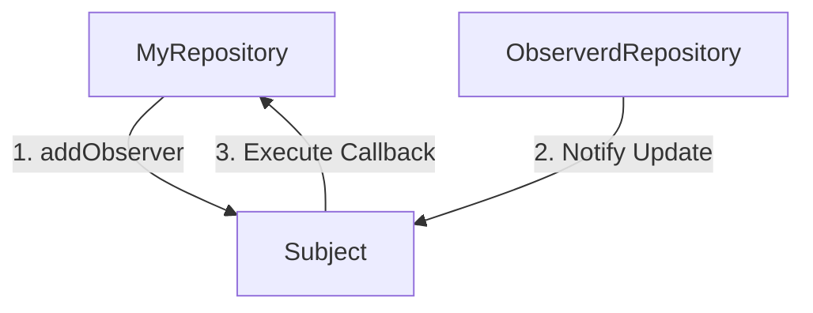

# Observers

An observer is a class will be called after an insert, update or delete record in the DB.



## Example

```php
<?php
// This observer will be called after insert, update or delete a record on the table 'triggerTable' 
$myRepository->addObserver(new class($this->infoMapper->getTable()) implements ObserverProcessorInterface {
    private $table;

    public function __construct($table)
    {
        $this->table = $table;
    }

    public function process(ObserverData $observerData)
    {
        // Do something here
    }

    public function getObserverdTable(): string
    {
        return $this->table;
    }
});
```

The `ObserverData` class contains the following properties:
- `getTable()`: The table name that was affected
- `getEvent()`: The event that was triggered. Can be 'insert', 'update' or 'delete'
- `getData()`: The data that was inserted or updated. It is null in case of delete.
- `getOldData()`: The data before update. In case of insert comes null, and in case of delete comes with the param filters.
- `getRepository()`: The repository is listening to the event (the same as $myRepository)

*Note*: The observer will not be called if the insert, update or delete is called using the DBDriver object.

