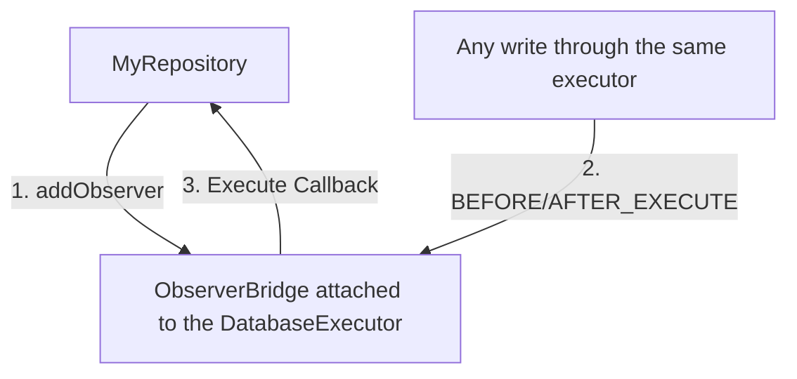

# Observers

An observer is a class that is called when a record is inserted, updated or deleted in the DB.

Since version 7.0 the observers are dispatched by the low-level
[anydataset-db executor observer](https://github.com/byjg/php-anydataset-db):
every `Repository` attaches a bridge to its `DatabaseExecutor`, and any write statement built by
MicroOrm that flows through that executor notifies the observers watching its table — no matter if
the write came from a `Repository` method, `buildAndExecute()`, `bulkExecute()` or a built query
executed directly on the executor.


```mermaid
flowchart TD
    A[MyRepository] --> |1. addObserver| B[ObserverBridge attached to the DatabaseExecutor]
    C[Any write through the same executor] --> |2. BEFORE/AFTER_EXECUTE| B
    B --> |3. Execute Callback| A
```

## Example

```php
<?php
// This observer will be called after insert, update or delete a record on the table 'triggerTable'
$myRepository->addObserver(new class('triggerTable') implements ObserverProcessorInterface {
    private $table;

    public function __construct($table)
    {
        $this->table = $table;
    }

    public function process(ObserverData $observerData): void
    {
        // Do something here
    }

    public function onError(Throwable $exception, ObserverData $observerData): void
    {
        // Called when process() throws. The write is never aborted by process().
    }

    public function getObservedTable(): string
    {
        return $this->table;
    }
});
```

The `ObserverData` class contains the following properties:

- `getTable()`: The table name that was affected
- `getEvent()`: The `ObserverEvent` that was triggered: `Insert`, `Update`, `Delete` or `SoftDelete`
- `getData()`: The data that was inserted or updated. It is null in case of delete.
  For writes issued outside `Repository::save()` (bulk, direct executions) the entity is not
  available and the SQL parameters array is provided instead.
- `getOldData()`: The data before update. In case of insert comes null, and in case of delete comes with the param filters.
- `getRepository()`: The repository listening to the event (the same as `$myRepository`)
- `getStatement()`: The `OrmSqlStatement` that triggered the event, with the SQL text (`getSql()`) and
  parameters (`getParams()`)

## Which writes fire events

| Write | Event | data / oldData |
|-------|-------|----------------|
| `save()` insert | `Insert` | hydrated entity (with generated keys) / null |
| `save()` update | `Update` | entity / previous entity |
| `delete()` / `deleteByQuery()` | `Delete` | null / where params |
| `delete()` with soft delete enabled | `SoftDelete` | null / where params (the row still exists, with `deleted_at` set) |
| `bulkExecute()` | one event per write statement, after commit (nothing on rollback) | params |
| `buildAndExecute()` or a built query executed directly on the executor | per builder | params |

*Note*: Raw SQL strings executed on the executor (not built by a MicroOrm query builder) do not fire
entity events. Attach a raw `DatabaseEventObserverInterface` (below) if you need to see everything.

## Observer scope

Observers are scoped to the `DatabaseExecutor` instance(s) of the repository where
`addObserver()` was called. Writes through another executor — even on the same database — do not
notify. If you need to observe more than one connection, register the observer on a repository of
each one.

## Before hook (veto)

If the processor also implements `StatementHookInterface`, it is called right before the SQL of an
observed table executes:

```php
<?php
class MyObserver implements ObserverProcessorInterface, StatementHookInterface
{
    public function beforeStatement(OrmSqlStatement $statement, Repository $repository): void
    {
        // Full access to $statement->getSql() and $statement->getParams().
        // Throwing here ABORTS the write.
    }

    // ... process(), onError(), getObservedTable()
}
```

## Low-level observers

`Repository::addObserver()` also accepts a raw
`ByJG\AnyDataset\Db\Interfaces\DatabaseEventObserverInterface`. It is attached directly to the
repository executors and receives the anydataset-db events (`BEFORE_QUERY`, `AFTER_QUERY`,
`BEFORE_EXECUTE`, `AFTER_EXECUTE`) for every statement, including reads and raw SQL.
